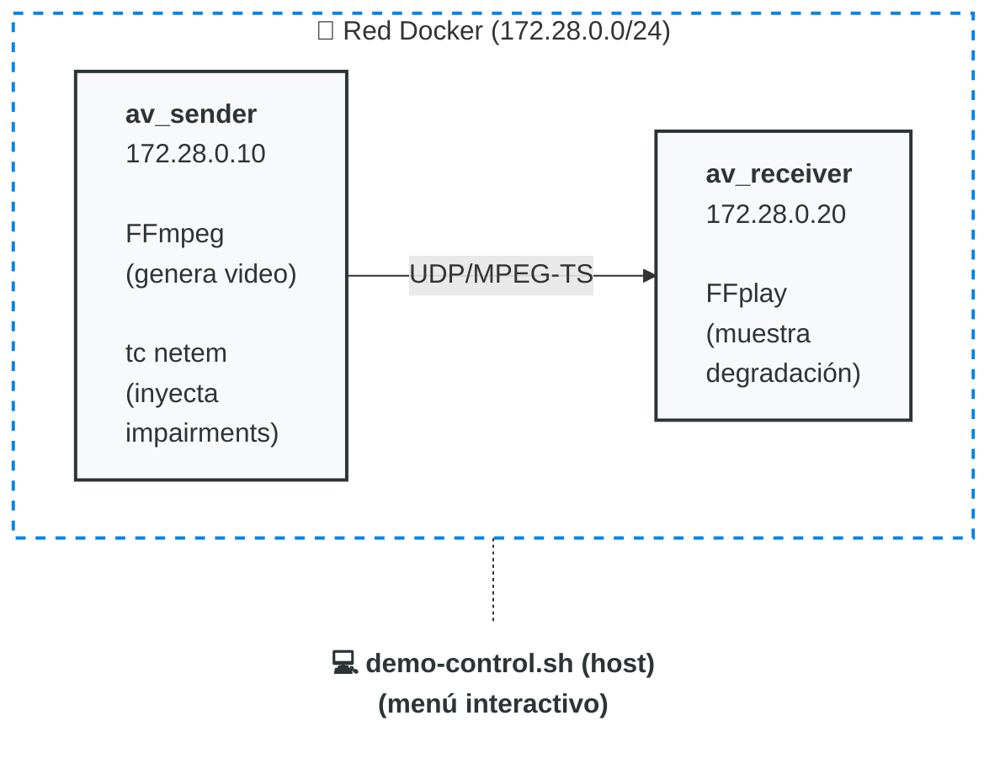

# Simulador de Jitter y Latencia en Video sobre IP

[](https://github.com/jdpinedac/network-simulator-av/actions/workflows/build.yml)

**Conferencia:** "Hackeando la Señal: La Verdad Oculta de la Infraestructura de Video sobre IP"
**AVIXA 2026** | Juan Pineda

> **Disclaimer:** Este simulador es una herramienta estrictamente educativa diseñada para ilustrar
> conceptos de degradación de red en entornos de Video sobre IP. El autor no posee formación en
> ingeniería de broadcast. En consecuencia, los parámetros de los escenarios (latencia, jitter y
> pérdida de paquetes) se presentan como aproximaciones didácticas. Estos valores pueden no ser
> óptimos para todos los casos de uso y no pretenden representar fielmente el comportamiento de una
> red de producción broadcast profesional o de misión crítica.

---

## Arquitectura



## Componentes

| Componente | Descripción |
|---|---|
| `sender` | Genera barras SMPTE con reloj y frame counter vía FFmpeg. Tiene `tc netem` para inyectar latencia/jitter/pérdida |
| `receiver` | Recibe el stream UDP y lo muestra con FFplay (X11). Los artefactos son visibles en tiempo real |
| `demo-control.sh` | Script de control interactivo con escenarios predefinidos |

## Requisitos

- Docker 20+ con Docker Compose v2
- Linux con X11 (para mostrar video en ventana)
- Kernel con soporte `netem` (estándar en Ubuntu/Debian)
- Capacidad `NET_ADMIN` disponible para Docker

## Inicio Rápido

```bash
# 1. Setup inicial (solo la primera vez)
chmod +x setup.sh && ./setup.sh

# 2. Levantar contenedores
docker compose up -d

# 3. Control interactivo (incluye streaming + video + escenarios)
./demo-control.sh
```

## Guión de la Demo

### Paso 1: Red Ideal (baseline)
- Seleccionar escenario **1** → 0ms latencia, 0% pérdida
- El video se ve perfectamente fluido, 100% de frames limpios
- El tono de audio es continuo

### Paso 2: Degradación gradual (recorrer niveles 2→5)
- **2** → 0.05% loss: glitch raro (cada ~5s), genuinamente sutil
- **3** → 0.2% loss: artefactos ocasionales (~1/s)
- **4** → 1.5% loss: artefactos frecuentes (~5/s), ~1 de cada 5 frames afectado
- **5** → 3% loss: degradación clara, ~40% de frames con artefactos
- *Concepto: así se degrada la señal progresivamente sin QoS*

### Paso 3: Pérdida severa (niveles 6-7)
- **6** → 5% loss + 1% corrupción: mayoría de frames dañados + distorsión de color
- **7** → 10% loss + 2% corrupción: artefactos constantes, casi impresentable
- *Concepto: WiFi con interferencia, enlace saturado*

### Paso 4: Colapso total (niveles 8-9)
- **8** → 20% loss: el stream se desintegra (~3% de frames limpios)
- **9** → 40% loss + 5% corrupción: destrucción total
- *Concepto: Lo que pasa sin QoS ni VLAN segregada*

### Paso 5: Medir el impacto (ping + iperf3)
- Presionar **i** para ping (configurable, default 10 pings). Muestra latencia y jitter real
- Presionar **n** para iperf3 UDP (configurable: bandwidth default 4 Mbps, duración default 10s)
- Muestra ancho de banda real, jitter y pérdida de paquetes bajo las reglas netem activas
- Con impairments severos (>20% loss), iperf3 reintenta hasta 3 veces (su canal TCP de control también es afectado)
- *Concepto: Cuantificar el daño que causan los impairments*

### Paso 6: Recuperación
- Seleccionar escenario **1** o presionar **p**
- *Concepto: El valor del QoS y la segregación de tráfico*
- El video vuelve a verse perfectamente (FFplay se reinicia con buffers limpios)
- También se puede bajar directamente de nivel (ej: 9→2) — FFplay se reinicia automáticamente para vaciar las colas internas corruptas

### Paso 7: Salida Limpia
- Presionar **q** para salir
- Se cierran automáticamente las ventanas de video, streams y procesos
- Para detener los contenedores: `docker compose down`

---

## Escenarios Disponibles

Los niveles usan **pérdida de paquetes incremental** como diferenciador principal.
Con `-g 1` (all I-frames), cada frame = ~16 paquetes UDP. Frames limpios = `(1-loss%)^16`.

> **Nota:** Los porcentajes de "~Frames OK" aplican a SMPTE bars con `-g 1` (all I-frames). En modo archivo (GOP=30), la degradación es más visible porque los errores se propagan entre frames dependientes (P-frames) hasta el siguiente I-frame.

| # | Nombre | Delay | Jitter | Loss | Corrupt | ~Frames OK | Caso real |
|---|---|---|---|---|---|---|---|
| 1 | Red ideal LAN | 0ms | 0ms | 0% | 0% | 100% | Switch gestionado con QoS |
| 2 | LAN micro-pérdidas | 2ms | 1ms | 0.05% | 0% | 99% | LAN sin gestión de QoS |
| 3 | WAN estable | 20ms | 5ms | 0.2% | 0% | 97% | Enlace WAN continental |
| 4 | WAN con congestión | 40ms | 15ms | 1.5% | 0% | 79% | Red con tráfico best-effort |
| 5 | Enlace degradado | 60ms | 25ms | 3% | 0% | 61% | Ancho de banda agotado |
| 6 | Pérdida severa | 80ms | 30ms | 5% | 1% | 44% | WiFi con interferencia |
| 7 | Enlace crítico | 100ms | 40ms | 10% | 2% | 18% | WiFi en área densa |
| 8 | Colapso de red | 150ms | 60ms | 20% | 3% | 3% | Red mixta sin QoS |
| 9 | Catastrófico | 200ms | 100ms | 40% | 5% | ~0% | Fallo total de infraestructura |

---

## Conceptos Técnicos Demostrados

### Jitter
- **Definición:** Variación en el tiempo de llegada de paquetes
- **Efecto en video:** Frames llegan fuera de orden → congelamiento, saltos
- **Efecto en audio:** Muestras faltantes → clicks, silencios, distorsión
- **Solución:** Jitter buffer (QoS prioriza paquetes de tiempo real)

### Latencia
- **Definición:** Retardo total en la transmisión extremo a extremo
- **Efecto en AV:** Desincronización A/V, problemas en sistemas interactivos
- **Referencia:** ITU-T G.114 recomienda <150ms para voz interactiva

### Pérdida de Paquetes
- **Efecto en UDP (sin retransmisión):** Artefactos visuales permanentes
- **Efecto en TCP:** Retransmisión → mayor latencia y jitter (peor para tiempo real)
- **Por qué UDP para AV en vivo:** Más vale perder un frame que llegar tarde

### Por qué UDP sin TCP para broadcast en vivo
TCP garantiza entrega pero introduce latencia variable (retransmisiones).
Para video en tiempo real, UDP + FEC (Forward Error Correction) es preferible.
Protocolos como SRT añaden recuperación sin la penalidad de TCP.

---

## Estructura de Archivos

```
network-simulator-av/
├── docker-compose.yml          # Orquestación de contenedores
├── demo-control.sh             # Control interactivo principal
├── setup.sh                    # Setup inicial
├── README.md                   # Este archivo
├── sender/
│   ├── Dockerfile              # Ubuntu 22.04 + FFmpeg + iproute2 + iperf3
│   ├── stream.sh               # Generador de stream (FFmpeg)
│   └── apply-netem.sh          # Aplicar/quitar impairments (tc netem)
└── receiver/
    ├── Dockerfile              # Ubuntu 22.04 + FFmpeg + iperf3
    ├── receive.sh              # Display del stream (FFplay + X11)
    └── receive-stats.sh        # Modo estadísticas (sin display gráfico)
```

---

## Troubleshooting

**El video no aparece (error DISPLAY)**
```bash
xhost +local:docker
export DISPLAY=:0
```

**FFplay abre pero no muestra video (vq=0KB, "datagram lost")**

Esto ocurre si los parámetros de FFplay son demasiado agresivos. Verificar en `receive.sh`:
- `-probesize` debe ser >= `1000000` (1MB). Valores muy pequeños (ej: 32) impiden detectar el formato MPEG-TS (PAT/PMT tables).
- `-analyzeduration` debe ser >= `1000000`. Con `0` no se analiza el stream.
- **No usar** `-avioflags direct`: elimina el buffering de I/O y causa pérdida de datagramas UDP.
- La URL UDP debe incluir `buffer_size=65536` para un buffer suficiente.

```bash
# Verificar que FFplay está decodificando (vq debe ser > 0):
docker exec av_receiver pgrep -a ffplay
# Si vq=0KB → reconstruir receiver con los parámetros corregidos
docker compose build receiver && docker compose up -d
```

**Los impairments no se aplican**
```bash
# Verificar que el contenedor tiene NET_ADMIN
docker inspect av_sender | grep -i "CapAdd"
# Debe mostrar: "NET_ADMIN"
```

**El stream no llega al receiver**
```bash
# Verificar conectividad
docker exec av_sender ping -c 3 172.28.0.20

# Medir ancho de banda y pérdida UDP real (iperf3)
# Desde el menú interactivo: opción 'n'
# O manualmente:
docker exec -d av_receiver iperf3 -s
docker exec av_sender iperf3 -c 172.28.0.20 -u -b 4M -t 5

# Ver estadísticas de red
docker exec av_sender tc qdisc show dev eth0
```

**Reconstruir desde cero**
```bash
docker compose down --volumes --remove-orphans
docker compose build --no-cache
docker compose up -d
```
